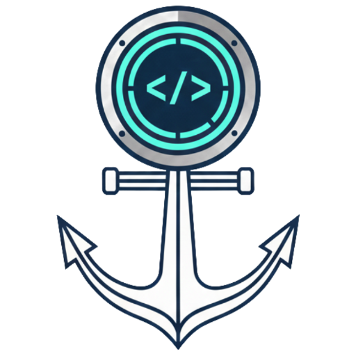
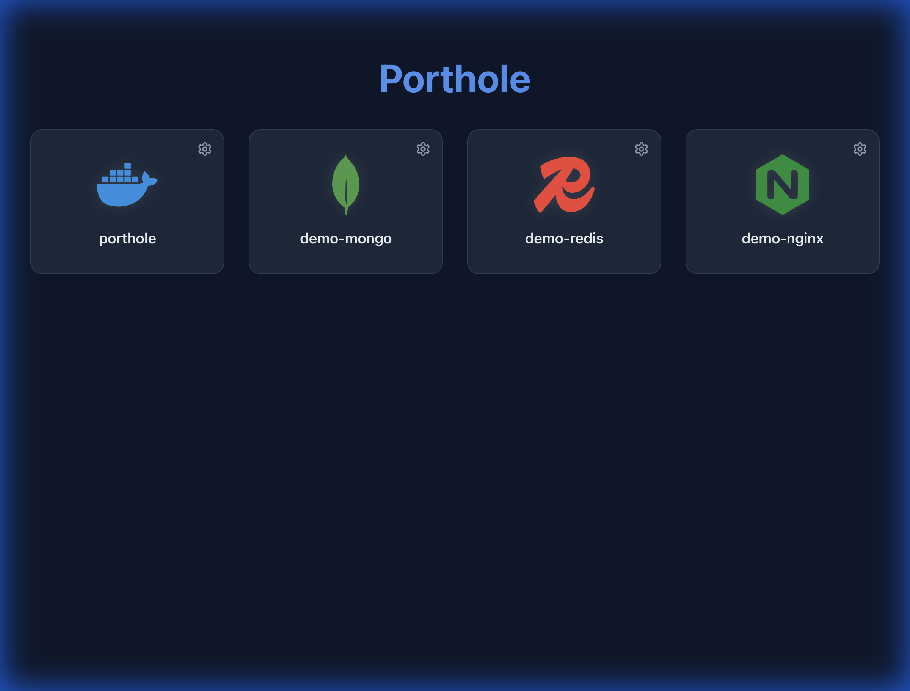

# Porthole ⚓️



> A modern, lightweight dashboard for your local Docker containers.



Porthole automatically discovers your running Docker containers and provides a beautiful, clean interface to access them. It resolves container icons automatically using [Dashboard Icons](https://github.com/homarr-labs/dashboard-icons) and allows you to quickly jump to exposed ports.

## Features

- 🕵️‍♂️ **Auto-Discovery**: Automatically lists all running containers with exposed ports.
- 🎨 **Automated Icons**: Maps container image names to icons (e.g., `redis` → Redis icon).
- 🔄 **Update Detection**: Checks Docker Hub for newer image versions and digest changes.
- 📦 **Compose Grouping**: Groups containers by Docker Compose project.
- 🔌 **Port Selection**: Remembers your preferred port for containers exposing multiple ports.
- 🐳 **Docker Native**: Runs as a single, lightweight Docker container.
- 🛠 **Customizable**: Override icon mappings via a simple JSON configuration.

## Quick Start

Run Porthole with a single Docker command:

```bash
docker run -d \
  -p 9753:9753 \
  -v /var/run/docker.sock:/var/run/docker.sock \
  --name porthole \
  porthole
```

**Note**: Mounting `/var/run/docker.sock` is required for Porthole to see your other containers.

Open [http://localhost:9753](http://localhost:9753) to view your dashboard.

## Configuration

Porthole attempts to match container image names to icons automatically. If you use custom image names or want to change an icon, you can provide a custom `icons.json` file.

See [Configuration Documentation](docs/CONFIGURATION.md) for details.

## Development

Porthole is a **Single JAR** application. The React client is built and bundled into the Spring Boot backend during the Maven build process.

### Prerequisites
- Java 25+
- Maven
- Node.js 20+ and npm (for client-only development)
- Docker (for containerized builds)

### Building from Source

#### Build Backend Only
Build just the Spring Boot backend without the client:
```bash
cd server
mvn clean package -DskipTests
```
The JAR will be in `server/target/porthole-0.0.1-SNAPSHOT.jar` but won't include client assets.

#### Build Client Only
Build just the React client:
```bash
cd client
npm install
npm run build
```
The built client will be in `client/dist/`.

#### Build Backend + Client (Complete Application)
Build the complete application with client bundled into the backend JAR:
```bash
cd server
mvn clean package -DskipTests -Pbuild-client
```
The client will be automatically built and copied into the JAR's static resources.

#### Build Docker Image
Build the containerized application:
```bash
# From the project root
docker build -t porthole:latest .
```
The Dockerfile uses a multi-stage build that automatically builds both client and backend.

### Running Locally

```bash
# Run the JAR directly
java -jar server/target/porthole-0.0.1-SNAPSHOT.jar

# Or run with Docker
docker run -p 9753:9753 -v /var/run/docker.sock:/var/run/docker.sock porthole:latest
```

Access the application at `http://localhost:9753`

See [Architecture Documentation](docs/ARCHITECTURE.md) for more details on the tech stack.

## License

MIT
